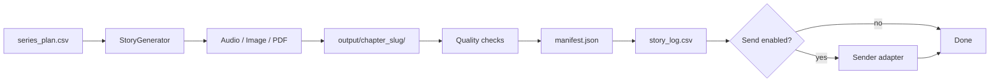

# Krishna Story Factory

Local Python automation that generates one daily Krishna-conscious bedtime story package for children ages **7–11**.

- **No Notion** — CSV files are the project-management source of truth
- **CLI first** — `run_daily_story.py` is the core engine
- **Streamlit optional** — lightweight dashboard for queue, logs, and manual runs
- **Lightweight** — no database, no Docker, no background workers

Repository: [github.com/swap2you/krishna-story-factory](https://github.com/swap2you/krishna-story-factory)

---

## What it does

Each run picks the next **pending** row from `input/series_plan.csv`, generates a complete story package, runs quality checks, writes logs, and optionally delivers through a configured sender.



---

## Required outputs per story

Every package folder contains **nine files**:

```text
output/<chapter_no>_<slug>/
  story.md
  audio_script.txt
  whatsapp_caption.txt
  activity_sheet.pdf
  story_card.png
  image_prompt.txt
  parent_notes.md
  manifest.json
  narration.mp3
```

---

## Project layout

```text
krishna-story-factory/
  run_daily_story.py          # CLI entry point
  dashboard.py                # Optional Streamlit dashboard
  requirements.txt
  .env.example                # Copy to .env (never commit .env)

  input/
    series_plan.csv           # Story queue (status: pending | done)
    library_catalog.csv       # Approved source libraries
    config_profiles.csv       # Optional generation profiles
    whatsapp_recipients.csv   # Opted-in parent phone numbers for Cloud API

  tracking/
    story_log.csv             # One row per pipeline run
    send_log.csv              # Delivery attempts
    quality_log.csv           # Quality gate results

  krishna_story_factory/
    pipeline.py               # Orchestration
    csv_store.py              # CSV read/write
    config.py                 # .env loading
    generation/               # OpenAI or deterministic test content
    audio/                    # ElevenLabs or test MP3 placeholder
    image/                    # OpenAI image or local Pillow card
    pdf/                      # ReportLab activity sheet
    quality/                  # Automated acceptance gates
    senders/                  # WhatsApp, Telegram, Slack, Discord, manual

  docs/                       # Setup, API keys, automation, troubleshooting
  prompts/                    # Cursor agent prompt library
  scripts/                    # Windows Task Scheduler helpers
  tests/                      # pytest suite
```

---

## Quick start (Windows)

```powershell
git clone https://github.com/swap2you/krishna-story-factory.git
cd krishna-story-factory

python -m venv .venv
.\.venv\Scripts\Activate.ps1
pip install -r requirements.txt
copy .env.example .env

pytest -q
python run_daily_story.py --mode test --force
```

**Test mode** uses deterministic mock content and a tiny MP3 placeholder — no paid API calls.

---

## Production setup (live APIs)

1. Copy `.env.example` → `.env`
2. Add your keys (see [docs/API_KEYS_GUIDE.md](docs/API_KEYS_GUIDE.md))
3. Enable the services you want:

```env
OPENAI_TEXT_ENABLED=true
OPENAI_API_KEY=your_key
OPENAI_TEXT_MODEL=gpt-4.1

OPENAI_IMAGE_ENABLED=true
OPENAI_IMAGE_MODEL=gpt-image-1

ELEVENLABS_ENABLED=true
ELEVENLABS_API_KEY=your_key
ELEVENLABS_VOICE_ID=your_voice_id
```

4. Run:

```powershell
python run_daily_story.py --mode prod --force
```

---

## Core commands

| Command | Purpose |
|---------|---------|
| `python run_daily_story.py --mode test` | Free local run with mock content |
| `python run_daily_story.py --mode test --force` | Test run even if already sent today |
| `python run_daily_story.py --mode prod` | Live OpenAI / ElevenLabs when enabled |
| `python run_daily_story.py --mode prod --force` | Prod run with daily-send override |
| `python -m streamlit run dashboard.py` | Optional queue/log dashboard |
| `pytest -q` | Run acceptance tests |

---

## Story queue workflow

1. Add or edit rows in `input/series_plan.csv` with `status=pending`
2. Run the CLI (test or prod)
3. On success, the row is marked `done` and a log row is appended to `tracking/story_log.csv`
4. Output appears under `output/<chapter_no>_<slug>/`

Sample queue ships with chapters `001`–`004` marked `done` and **`005_boat-crossing` pending**.

---

## Sender modes

Set in `.env`:

```env
WHATSAPP_SEND_ENABLED=true
WHATSAPP_SENDER_TYPE=manual      # local staging only
WHATSAPP_SENDER_TYPE=web_test    # private outbox for manual forward
WHATSAPP_SENDER_TYPE=cloud       # WhatsApp Business Cloud API (recommended)
WHATSAPP_SENDER_TYPE=telegram    # fallback
WHATSAPP_SENDER_TYPE=slack       # fallback
WHATSAPP_SENDER_TYPE=discord     # fallback
```

WhatsApp Cloud v1:

- Template messages only (`hello_world` for Meta test setup)
- Broadcast one-by-one to opted-in numbers in `input/whatsapp_recipients.csv`
- No WhatsApp group sending in v1
- Smoke test: `.\.venv\Scripts\python.exe scripts/test_whatsapp_cloud.py`
- Production path: approved template (`daily_krishna_story`) + Google Drive package link

Recommended rollout:

1. `web_test` — one-week private staging
2. `cloud` — production WhatsApp Business Cloud
3. `telegram` — if WhatsApp API approval is slow

See [docs/SENDER_OPTIONS_GUIDE.md](docs/SENDER_OPTIONS_GUIDE.md) and [docs/WHATSAPP_BUSINESS_CLOUD_GUIDE.md](docs/WHATSAPP_BUSINESS_CLOUD_GUIDE.md).

---

## Daily automation

Use Windows Task Scheduler with `scripts/run_daily_story_windows.ps1`.  
See [docs/DAILY_AUTOMATION_GUIDE.md](docs/DAILY_AUTOMATION_GUIDE.md).

Optional: point `OUTPUT_ROOT` in `.env` to a Google Drive Desktop Sync folder.

---

## Documentation index

| Doc | Topic |
|-----|-------|
| [docs/ARCHITECTURE.md](docs/ARCHITECTURE.md) | System design and module map |
| [docs/SETUP_GUIDE.md](docs/SETUP_GUIDE.md) | First-time install |
| [docs/API_KEYS_GUIDE.md](docs/API_KEYS_GUIDE.md) | OpenAI, ElevenLabs, Streamlit |
| [docs/IMPLEMENTATION_PLAN.md](docs/IMPLEMENTATION_PLAN.md) | Phased rollout plan |
| [docs/TESTING_AND_ACCEPTANCE.md](docs/TESTING_AND_ACCEPTANCE.md) | Quality gates and test commands |
| [docs/CSV_GUIDE.md](docs/CSV_GUIDE.md) | CSV schemas |
| [docs/DASHBOARD_GUIDE.md](docs/DASHBOARD_GUIDE.md) | Streamlit usage |
| [docs/CONTENT_SAFETY_GUIDE.md](docs/CONTENT_SAFETY_GUIDE.md) | Child-safe content rules |
| [docs/TROUBLESHOOTING.md](docs/TROUBLESHOOTING.md) | Common fixes |

**Cursor agents:** start with `prompts/00_MASTER_PROMPT.md`.

---

## Testing

```powershell
pytest -q
python run_daily_story.py --mode test --force
```

Acceptance criteria:

- Tests pass
- All nine output files exist and are non-empty
- `manifest.json` includes `source_reference`, `library_id`, `age_range`, `generated_at`
- Quality status is `PASS`

---

## Git safety

**Never commit:**

- `.env` (API keys)
- `output/*` generated packages (except `.gitkeep`)
- `.venv/`, logs, caches, WhatsApp test outbox

`.env.example` documents all settings without secrets.

---

## License

Private project — see repository owner for usage terms.
