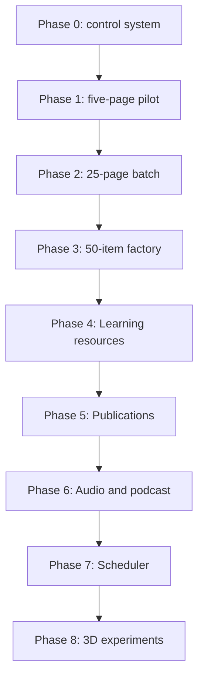

# Phased Program Roadmap

## Operating rule

Only one phase is active. A phase may contain A/B/C work packets and one consolidated remediation cycle. Minor deferred enhancements go to the next phase; correctness, privacy, source, accessibility, or acceptance failures remain in the current phase.

## Phase 0 — Program control and prompt library

**Goal:** lock the operating system before writing product code.

- 0A: reconcile handoffs, current state, and constraints;
- 0B: define program roadmap, UX/content standards, SDLC, agents, evidence;
- 0C: package Cursor prompts, templates, and maintenance controls;
- 0R: validate internal consistency, package integrity, and owner review.

**Exit:** owner approves this package and authorizes Phase 1 discovery. No code implementation is implied.

## Phase 1 — Governed visual learning-page pilot

**Goal:** prove one modern reusable page system using five representative prayer/mantra records.

- 1A Discovery: repository, existing components, data, routes, export capability, fonts, assets, tests.
- 1B Requirements/UX: page anatomy, four depth lenses, visual directions, source contract, print/export specification.
- 1C Architecture: canonical schema/block model, component map, source dossier import, asset manifest, export strategy.
- 1D Implementation: single writer; five private preview records; Studio status visibility; web + PDF/DOCX-capable paths.
- 1E Validation: automated tests, three-browser/mobile UAT, Devanāgarī/IAST, print render, security/privacy, content/source review.
- 1R Consolidated remediation: all acceptance failures grouped, fixed, rerun, and evidenced once.

**Exit:** five private preview pages meet the Phase 1 acceptance matrix; PR may be opened to `develop`. No staging or production.

## Phase 2 — Controlled 25-page content batch

**Goal:** test repeatability across page types and topics without scheduler automation.

- Use approved templates and source dossiers only.
- Mix prayers, mantras, ślokas, concepts, short lives, festival learning, and etiquette.
- Measure reviewer hours, defect rate, content drift, asset effort, export reliability, and accessibility.

**Exit:** 25 records accepted with no source/privacy P0/P1 defect and a stable throughput baseline.

## Phase 3 — Fifty-item batch factory

**Goal:** create repeatable queue-driven drafting for 50 approved roadmap items.

- Add batch manifests, resumability, deterministic templates, duplicate detection, prompt/version ledger, and Studio queues.
- Automation may create private drafts and evidence only.
- Human reviewers approve each canonical record/release candidate.

**Exit:** two consecutive 50-item dry/private batches complete within quality and review-capacity limits.

## Phase 4 — Learning resources

**Goal:** derive Sunday School/teacher guides, worksheets, printables, activities, assessments, and answer keys from approved canonical records.

Derivatives retain canonical record/version, age profile, learning objective, source lineage, reviewer decisions, and independent-creation evidence.

## Phase 5 — E-books and publication packages

**Goal:** assemble approved content into PDF/EPUB/print packages through Publishing Studio. Do not duplicate public platform responsibilities.

## Phase 6 — Audio and podcast pilot

**Goal:** add transcripts/audio and child-accessible discussion formats only after text governance is stable. See `09_FUTURE_AUDIO_PODCAST_AND_3D.md`.

## Phase 7 — Scheduler and controlled scale

**Goal:** enable scheduled private draft production only after manual and batch pilots prove quality, reviewer capacity, recovery, and cost controls.

Scheduler can select, dossier, draft, test, and prepare release candidates. It cannot approve, merge, deploy, or publish.

## Phase 8 — 3D/motion research

Backburner only. No integration until the core platform is stable and the prototype is reproducible, governed, affordable, and does not delay documentation throughput.

## Phase completion rule

A phase is complete only when:

1. requirements are baselined;
2. every acceptance criterion maps to evidence;
3. applicable automated and human gates pass;
4. consolidated remediation is closed;
5. docs/runbooks/ADRs are current;
6. branch and repository hygiene is verified;
7. owner explicitly accepts the phase.

